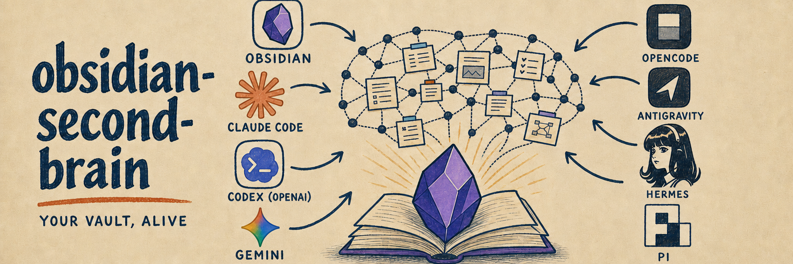

# dsh-obsidian-second-brain

简体中文 | [English](#english)



[](./LICENSE)
[](https://github.com/deepseek-ai/deepseek-harness)
[](https://github.com/eugeniughelbur/obsidian-second-brain)

> **一句话：把你的 Obsidian 笔记库变成会自我维护的第二大脑 —— 记下的东西会被重新整理、互相印证，过时的事实会被标出来，而不是越堆越乱。**

移植自 [`eugeniughelbur/obsidian-second-brain`](https://github.com/eugeniughelbur/obsidian-second-brain)（MIT），
pin 上游 `main` HEAD `4d5b673`（2026-08-08；上游自述版本 v0.14.0），
上游的 `SKILL.md`、46 个命令与全部脚本逐字保留，只适配了 [DeepSeek Harness](https://github.com/deepseek-ai/deepseek-harness) 的插件形态。

> 注意：上游内容为英文（命令触发词含多语言，含中文），按移植规则未做翻译 —— 这是上游原样。

## ✨ 功能

- 🧠 **自我重写的知识库** —— 新来源会更新既有页面而不是只追加；矛盾自动调和（Karpathy LLM Wiki 模式的演进）
- 🗂️ **46 个命令** —— 记录、日记、项目、人物、任务、看板、决策、复盘、检索、健康检查，覆盖第二大脑的完整工作流（完整清单见下方折叠区）
- 🔍 **混合语义检索** —— 标题加权检索 + 检索质量自评（`/obsidian-retrieval-eval`）
- 🌐 **研究工具箱** —— 7 个命令：X / 网页 / YouTube / 播客 / NotebookLM 研究，结果自动存入笔记库
- ⏰ **定时维护** —— 会话结束与后台 agent 自动整理笔记库
- ✅ **AI-first 写入规则** —— 每条笔记带结构化 frontmatter、wikilink、来源与置信度，面向未来 Claude 的检索而非人类阅读（规范见 [`AI-FIRST.md`](AI-FIRST.md) 与 [`references/ai-first-rules.md`](references/ai-first-rules.md)）
- 🔗 **类型化图谱** —— 笔记间的 `supersedes` / `depends_on` / `contradicts` 等关系可被脚本验证

<details>
<summary>全部 46 个命令</summary>

| 命令 | 用途 |
|---|---|
| `/obsidian-save` | 把对话整理成互相链接的 AI-first 笔记（人物/项目/决策/任务/看板/日记） |
| `/obsidian-capture` | 零摩擦记下一个想法 |
| `/obsidian-daily` | 创建或更新今日日记 |
| `/obsidian-calendar` | 日历视图与日程 |
| `/obsidian-recurring` | 周期性任务 |
| `/obsidian-log` | 记录工作/开发会话 |
| `/obsidian-task` | 一次性任务 |
| `/obsidian-person` | 人物笔记 |
| `/obsidian-project` / `/obsidian-projects` | 项目笔记 |
| `/obsidian-board` / `/obsidian-board-hygiene` | 看板与看板清理 |
| `/obsidian-decide` | 决策记录（`--formal` 为正式 ADR） |
| `/obsidian-reconcile` | 调和笔记库中的矛盾 |
| `/obsidian-synthesize` | 跨来源模式综合 |
| `/obsidian-find` | 检索笔记 |
| `/obsidian-recap` / `/obsidian-review` | 复盘 / 周月回顾 |
| `/obsidian-health` | 笔记库健康检查 |
| `/obsidian-reindex` / `/obsidian-retrieval-eval` | 检索索引与质量自评 |
| `/obsidian-export` / `/obsidian-visualize` | 导出 / 图谱可视化 |
| `/obsidian-init` / `/obsidian-architect` | 初始化 / 结构设计 |
| `/obsidian-ingest` | 摄入 URL/PDF/音频，笔记库自我重写 |
| `/obsidian-learn` / `/obsidian-emerge` / `/obsidian-graduate` | 学习 / 涌现模式 / 毕业归档 |
| `/obsidian-brainstorm` / `/obsidian-challenge` | 头脑风暴 / 挑战 |
| `/obsidian-connect` / `/obsidian-world` | 知识连接 / 世界观 |
| `/obsidian-panel` / `/obsidian-catchup` / `/obsidian-distill` | 面板 / 追赶 / 蒸馏 |
| `/x-read` / `/x-pulse` | X（Twitter）深度阅读 / 脉搏 |
| `/research` / `/research-deep` / `/vault-deep-synthesis` | 研究 / 深度研究 / 笔记库深度综合 |
| `/notebooklm` / `/youtube` / `/podcast` | NotebookLM / YouTube / 播客 |
| `/create-command` / `/idea-discovery` | 创建新命令 / 想法发现 |

</details>

## 📸 效果

在一个初始化好的 Obsidian 笔记库里，运行 `/obsidian-save` 会把一段对话整理成互相链接的 AI-first 笔记（人物、项目、决策、任务、看板卡片、日记各一条），而不是把整段对话原样倒进一个文件。

```
> /obsidian-save

  读取 vault 根目录 _CLAUDE.md 的操作规则
  为本次对话中的新人建立人物笔记（含来源与日期）
  在项目笔记中追加本次决策（记录矛盾并调和）
  在今日日记中登记任务与看板卡片
  → 6 条笔记，互相 wikilink，全部符合 AI-first 规则
```

没有任何内容可记时：

```
> /obsidian-find 这个决策

  未找到匹配笔记 —— 已如实说明，未编造任何条目
```

## 📦 安装

```bash
dsh plugin --profile <你的 profile> add github:GongYuanCaiJi/dsh-obsidian-second-brain
```

若 pnpm 拦下构建步骤，在 profile 的 `pnpm-workspace.yaml` 里把本包加进 `allowBuilds`。

从本地目录安装（需要先自行安装依赖并跑测试）：

```bash
git clone https://github.com/GongYuanCaiJi/dsh-obsidian-second-brain.git
cd dsh-obsidian-second-brain && npm install && npm test
dsh plugin --profile <你的 profile> add ../dsh-obsidian-second-brain
```

## 🚀 用法

装好后，在 dsh 会话里使用 `obsidian-second-brain` 技能（会话开始时会出现在可用技能列表里），
它会按你的笔记库情况引导：先读 vault 根目录的 `_CLAUDE.md`（若有），再按需执行对应的笔记操作。

技能内容与 46 个命令的完整说明在上游 [`SKILL.md`](SKILL.md) 与 [`commands/`](commands/) —— 与上游逐字一致。

> 研究命令（`/research`、`/x-read` 等）依赖上游的 Python 研究工具（`pyproject.toml`，需 `uv`），
> 首次使用会在提示中说明。MCP 桥接（`integrations/obsidian-mcp-server/`）同样保留在上游原处，按需启用。

> 上游另提供面向 Claude Code 的一键安装脚本 `scripts/quick-install.sh`（curl 管道安装，
> 仅适用于 Claude Code 环境）；本移植保留该文件，但 dsh 安装请使用上面的 `dsh plugin add`。

## ✅ 移植保真

逐字保留，`npm test` 自动验证：`SKILL.md`、全部 46 个 `commands/*.md`、`references/`、`hooks/`、
`scripts/`、`integrations/` 等 321 个上游文件与钉住的 commit 逐字节一致
（[`THIRD_PARTY_NOTICES.md`](THIRD_PARTY_NOTICES.md) 钉住了上游 commit、archive integrity 与 SHA-256，
并附可直接复制的比对命令 —— 你可以自己验，不必信我们）。

dsh 适配（只有这些，逐一说明为什么非改不可）：

1. **新增 `package.json` / `cordis.patch.yml`** —— dsh 插件必须以 npm bundle 形式安装，上游是 Claude Code 插件没有这个文件
2. **`SKILL.md` 以 dsh skill 形式注册** —— 上游是 `~/.claude/skills/` 安装，dsh 通过 `skill-filesystem` 发现技能；文件本身逐字未动
3. **新增 `test/fidelity.test.mjs` + fixtures** —— 「逐字保留」要可自动验证：`npm test` 把每个上游文件与钉住的 commit 比对（playbook N4）
4. **新增 `THIRD_PARTY_NOTICES.md`** —— 钉住上游 commit / archive integrity / 逐字文件 SHA-256，附可复制的比对命令（playbook N4）
5. **`README.md` / `LICENSE` / `.gitignore` 为移植门面** —— 按移植惯例重写；LICENSE 为双版权（上游 + 本移植），GitHub 可识别为 MIT

上游的 Claude Code 专属文件（`.claude-plugin/`、`hooks.json`、`install.sh`、`update.sh`）按
「不挑不筛、上游有什么搬什么」规则完整保留，dsh 不使用它们但也不删除。

## 🛠 开发

```bash
npm install      # 安装依赖并触发 prepare（跑保真测试）
npm test         # 验证 321 个上游文件与钉住的 commit 逐字节一致
```

## 📄 License

MIT。上游 [`obsidian-second-brain`](https://github.com/eugeniughelbur/obsidian-second-brain)
`Copyright (c) 2026 Eugeniu Ghelbur`，本移植 `Copyright (c) 2026 GongYuanCaiJi`。见 [LICENSE](./LICENSE)。

感谢 [eugeniughelbur/obsidian-second-brain](https://github.com/eugeniughelbur/obsidian-second-brain)
的原作者 —— 如果这个插件对你有用，**也请去给[上游仓库](https://github.com/eugeniughelbur/obsidian-second-brain)点个 star**。

---

# English

[](./LICENSE)
[](https://github.com/deepseek-ai/deepseek-harness)
[](https://github.com/eugeniughelbur/obsidian-second-brain)

> **One line: turn your Obsidian vault into a self-maintaining second brain — captured knowledge gets re-organized, cross-checked, and stale facts get flagged instead of piling up.**

A port of [`eugeniughelbur/obsidian-second-brain`](https://github.com/eugeniughelbur/obsidian-second-brain)
(MIT) to [DeepSeek Harness](https://github.com/deepseek-ai/deepseek-harness), pinned to upstream
`main` HEAD `4d5b673` (2026-08-08; upstream self-reports v0.14.0). The upstream
`SKILL.md`, all 46 commands, and every script are kept byte-identical; only the plugin shape is adapted.

> Note: upstream content is in English (command triggers are multilingual, including Chinese);
> per the port's verbatim rule it is not translated — this is the upstream as-is.

## ✨ Features

- 🧠 **Self-rewriting knowledge base** — new sources update existing pages instead of just appending; contradictions reconcile (an evolution of Karpathy's LLM Wiki pattern)
- 🗂️ **46 commands** — capture, daily, person, project, task, board, decision, recap, search, health — the full second-brain workflow
- 🔍 **Hybrid semantic search** — title-weighted retrieval plus self-evaluated retrieval quality (`/obsidian-retrieval-eval`)
- 🌐 **Research toolkit** — 7 commands: X / web / YouTube / podcast / NotebookLM research, saved into the vault automatically
- ⏰ **Scheduled maintenance** — session-end and background agents keep the vault tidy
- ✅ **AI-first write rules** — every note carries structured frontmatter, wikilinks, sources, and confidence, built for future-Claude retrieval rather than human reading
- 🔗 **Typed graph** — relationships like `supersedes` / `depends_on` / `contradicts` are script-validated

## 📸 What it looks like

In an initialized vault, `/obsidian-save` turns a conversation into cross-linked AI-first notes
(person, project, decision, task, board card, daily entry) instead of dumping the transcript into one file:

```
> /obsidian-save

  reads _CLAUDE.md operating rules at the vault root
  creates person notes for new people (with sources and dates)
  appends this decision to the project note (reconciling contradictions)
  logs tasks and board cards in today's daily note
  → 6 linked notes, all AI-first compliant
```

When there is nothing to record:

```
> /obsidian-find that decision

  No matching note found — stated plainly, nothing fabricated
```

## 46 Commands

The full roster — every command from upstream, listed in the Chinese section above
(`全部 46 个命令`). The authoritative step-by-step for each lives in
[`commands/`](commands/) and [`SKILL.md`](SKILL.md), byte-identical to upstream.

## 📦 Install

```bash
dsh plugin --profile <your-profile> add github:GongYuanCaiJi/dsh-obsidian-second-brain
```

If pnpm blocks the build step, add this package to `allowBuilds` in the profile's `pnpm-workspace.yaml`.

From a local checkout (install dependencies and run the fidelity test first):

```bash
git clone https://github.com/GongYuanCaiJi/dsh-obsidian-second-brain.git
cd dsh-obsidian-second-brain && npm install && npm test
dsh plugin --profile <your-profile> add ../dsh-obsidian-second-brain
```

## 🚀 Usage

Once installed, use the `obsidian-second-brain` skill in a dsh session (it appears in the available
skills list at session start). It guides you based on your vault: read `_CLAUDE.md` at the vault root
if present, then perform the relevant note operations on demand.

The skill body and all 46 commands live in the upstream [`SKILL.md`](SKILL.md) and [`commands/`](commands/) — byte-identical to upstream.

> The research commands (`/research`, `/x-read`, …) depend on the upstream Python research toolkit
> (`pyproject.toml`, requires `uv`); the prompt explains on first use. The MCP bridge
> (`integrations/obsidian-mcp-server/`) is likewise kept as-is upstream, enabled on demand.

## ✅ Port fidelity

Byte-identical, verified automatically by `npm test`: `SKILL.md`, all 46 `commands/*.md`, `references/`,
`hooks/`, `scripts/`, `integrations/` — 321 upstream files in total — match the pinned commit
([`THIRD_PARTY_NOTICES.md`](THIRD_PARTY_NOTICES.md) pins the upstream commit, archive integrity, and
SHA-256, with copy-paste comparison commands — verify it yourself, no need to trust us).

The only dsh adaptations, each with its reason:

1. **Added `package.json` / `cordis.patch.yml`** — a dsh plugin must install as an npm bundle; the upstream is a Claude Code plugin without these files
2. **`SKILL.md` registered as a dsh skill** — upstream installs into `~/.claude/skills/`; dsh discovers skills via `skill-filesystem`; the file itself is untouched
3. **Added `test/fidelity.test.mjs` + fixtures** — so "byte-identical" is machine-verifiable: `npm test` compares every upstream file against the pinned commit (playbook N4)
4. **Added `THIRD_PARTY_NOTICES.md`** — pins the upstream commit / archive integrity / verbatim-file SHA-256, with copy-paste comparison commands (playbook N4)
5. **`README.md` / `LICENSE` / `.gitignore` are the port facade** — rewritten per port convention; LICENSE is dual-copyright (upstream + this port), still detected as MIT by GitHub

Claude-Code-specific upstream files (`.claude-plugin/`, `hooks.json`, `install.sh`, `update.sh`) are
kept verbatim per the "move everything, don't cherry-pick" rule; dsh does not use them but does not delete them.

## 🛠 Development

```bash
npm install      # installs deps and runs prepare (fidelity test)
npm test         # verifies the 321 upstream files match the pinned commit byte-for-byte
```

## 📄 License

MIT. Upstream [`obsidian-second-brain`](https://github.com/eugeniughelbur/obsidian-second-brain)
`Copyright (c) 2026 Eugeniu Ghelbur`; this port `Copyright (c) 2026 GongYuanCaiJi`. See [LICENSE](./LICENSE).

Thanks to the author of [eugeniughelbur/obsidian-second-brain](https://github.com/eugeniughelbur/obsidian-second-brain) —
if this plugin is useful to you, **please also star the
[upstream repository](https://github.com/eugeniughelbur/obsidian-second-brain)**.
